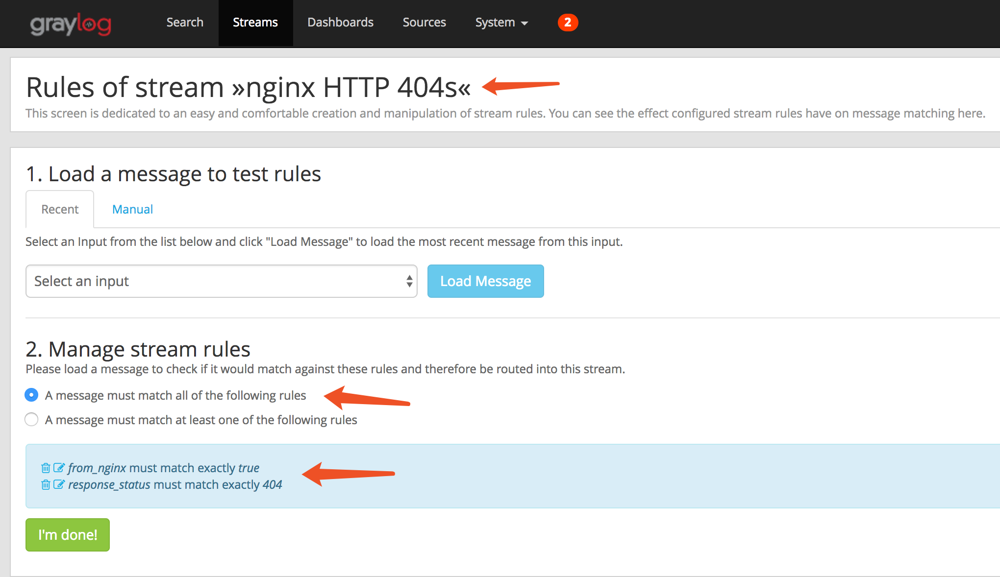
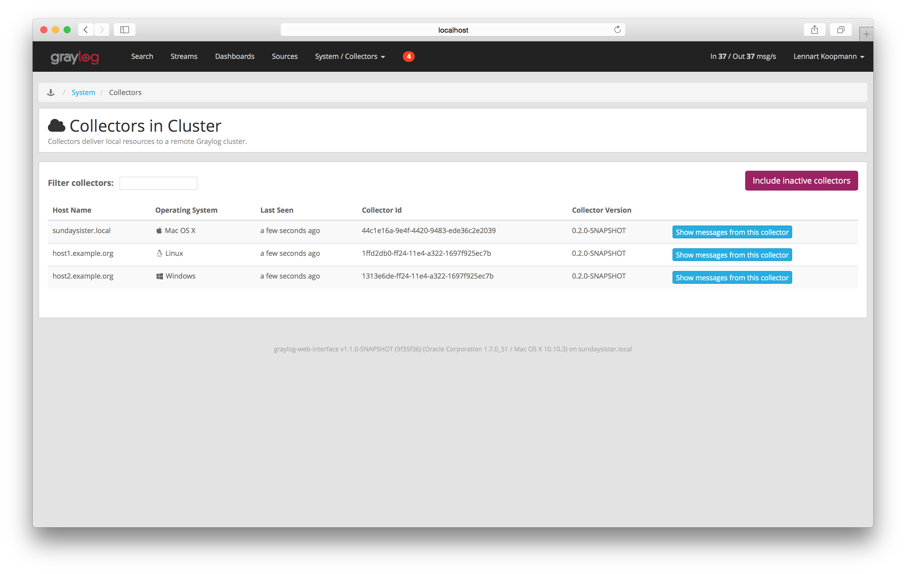

# graylog

## 功能

### 搜索

1. 搜索语言：

   * 自己实现的search query language，有详细的语法教程，学习成本较低(类似Apache Lucene语法)

2. 按时间搜索：

   * 支持相对时间范围搜索（e.g. 过去1小时/周/天）
   * 支持绝对时间范围搜索（e.g. 2017.5.12 5:12:21 - 2017.5.12 5:55:34)
   * **支持bao字范围搜索**    （e.g. “1st of april to 2 days ago”）遵循[natty natural language parser](http://natty.joestelmach.com/)语法

3. 保存搜索：

   * 界面直接点击，标示显眼，操作简单

   * 支持自定义搜索标题，方便查找

   * 直接在搜索栏下拉列表查找保存的搜索，操作简单易懂

     

     ​

4. 快速搜索

   * 在搜索结果中选择term，直接添加到搜索（e.g. 结果中包含request_path项，值为/a/system/notifications，可以直接点击添加搜索所有request_path为/a/system/notifications的纪录）

   * 添加之后支持编辑

     

5. 搜索结果高亮

   * 支持

     

### 统计

1. 搜索结果自动统计

   * 支持搜索结果自动生成直方图，统计符合条件的日志条数

2. 快速统计

   * 按字段统计，包括 total, mean, minimum, maximum, standard deviation, variance, sum, and cardinality，实时刷新

     

   * 字段值top统计

     

   * 按字段值统计趋势图(支持动态调整图表类型)

     

### 监控

1. 自定义dashboard

   * 支持自定义任意多个dashborad，每个dashboard可以包含任意多个元素

   * 支持拖拽式自定义元素布局

   * 支持全屏

   * 支持后台刷新

     

     

2. 添加dashborad元素

   * 几乎任意搜索结果／图表都可以方便的添加到任意一个dashboard

     

### 告警

1. 告警类型

   * 根据日志条数

     

   * 根据字段值范围

     

   * 根据字段值内容

     

2. 告警回调

   * http请求
   * 邮件

### 数据收集

#### 特点：

1. 支持无agent，也支持安装collector以收集本地日志文件
2. 支持大部分开发语言项目，以第三方开源插件包形式提供

#### 数据收集方式：应用主动发送日志给graylog server或安装collector。

1. 支持udp/tcp协议下的syslog方式。
2. 支持udp/tcp/http(s)协议下的[GELF][http://docs.graylog.org/en/2.3/pages/gelf.html](The Graylog Extended Log Format)方式（[简单侵入][https://marketplace.graylog.org/addons?page=3&search=gelf]，推荐的方式）。
3. 支持udp/tcp协议下的原始消息请求。
4. 支持自定义解析器（正则、分隔符、json、KV...），支持导入导出，有很多[现成的解析器][https://marketplace.graylog.org/addons?kind=content_pack]。
5. 支持中间加kafka、AMQP消息队列。
6. 安装collector以收集本地日志文件，支持多种方式的日志分割，如java的stack traces

#### 业务集成方式：

- [graylog market][https://marketplace.graylog.org/addons?page=3&search=gelf]中可以找到大部分环境支持的GELF开发包，包括java/c++/go/python/node.js/ruby/...
- 如果不能支持GELF可以打到syslog再通过解析器完成
- 如果希望直接读取本地日志文件则需要额外安装collector

### 高级功能

#### 1. 解析器

可以从原始输入的message中解析出应用自定义的字段并索引

* 可以为每个输入定义多个解析器

* 可以为解析出的字段继续定义解析器

* 利用es的映射机制实现，可以动态添加或修改

  nginx日志解析器器：

  

  例子：解析response status：

  

  nginx日志被所有解析器解析后的结果：

  

#### 2. 流

* graylog可以设置过滤器，将满足过滤条件的log分配到不同的流中以便分类搜索和告警

* 过滤条件可以自定义

  

#### 3. 插件

* input、output、告警和解析器的配置都可以以插件的方式进行导入或倒出，github社区较活跃

* 支持多种类型的plugin自定义

  

* 社区有很多第三方插件支持各种类型的日志输入

## 架构

- graylog server和es都可以做成集群模式，MongoDB可以做成多机备份，可以一个graylog server机器放一个mongoDB，基本不占资源
- server、web、es都可以水平扩展，并且真正存放数据的es支持在运行时动态调整副本数量，动态扩容缩容

## 管理

### 部署

- elasticsearch
- mongoDB
- graylog server
- graylog web interface
- graylog collector (optional)
- kafka/rabbitMQ…(optional)

各个模块分开部署，环境搭建较复杂

各模块分开配置，无法统一管理配置信息

### 扩展

只需要创建扩展节点，水平扩展即可，配置较简单

手动创建扩展节点，无法自动完成

### 自监控

* 通过web-interface可以监控每个collector、graylog-server和整个es集群的健康状态

  

  

  

* graylog-server发生错误会在web上显示通知

  

* 监控项较少

### 权限

* 默认存在管理员角色和reader角色

* 支持自定义角色
* 管理员可以分配不同的流和dashboard给不同的角色，这样该角色下的用户只能读取相关流和dashboard的数据

