# splunk

## 功能

### 搜索

1. 搜索语言

   * 自定义的SPL语言，更灵活也更复杂

2. 搜索类型

   * 输入来源（文件、网络端口等）
   * 主机（IP、域名）
   * 输入类型

3. 按时间搜索

   * web UI仅支持相对时间范围和绝对时间范围搜索

4. 保存搜索

   * 支持，操作简单便捷，搜索保存的历史更简单

5. 快速搜索

   * 更灵活的快速搜索，可以在message中直接选中某些内容进行搜索

   * **支持搜索管道，可以逐步增加管道中的条件逐步缩小范围**

     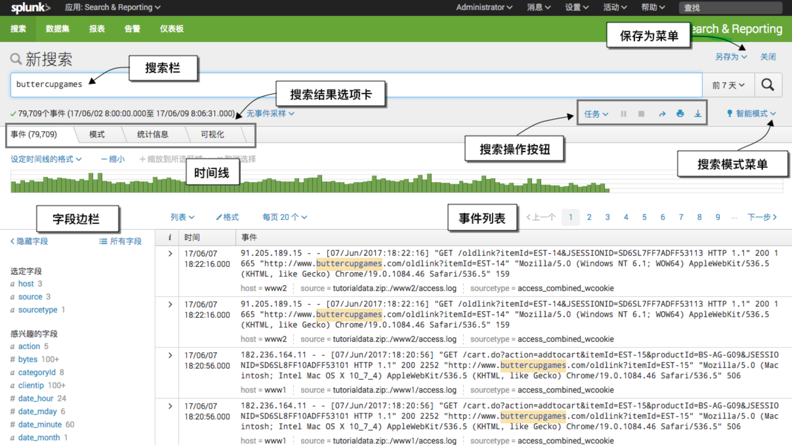

6. **三种搜索模式**

   * 快速模式（通过减少搜索返回的事件信息量提高搜索的速度）
   * 详细模式（返回尽可能多的事件信息）
   * 智能模式（自动根据所运行的搜索类型，在快速模式和详细模式之间切换搜索行为）

### 统计

* 基本无法直接通过界面点击进行简单直观的统计

* **支持统计命令，在搜索框中构造统计命令可以创建灵活丰富的统计数据，但是学习成本较高**

* **统计命令相当丰富，从一般的top、stats、chart等简单命令到高级的预测、报表命令都有，甚至有机器学习套件等以第三方插件形式提供的高级统计方法**

  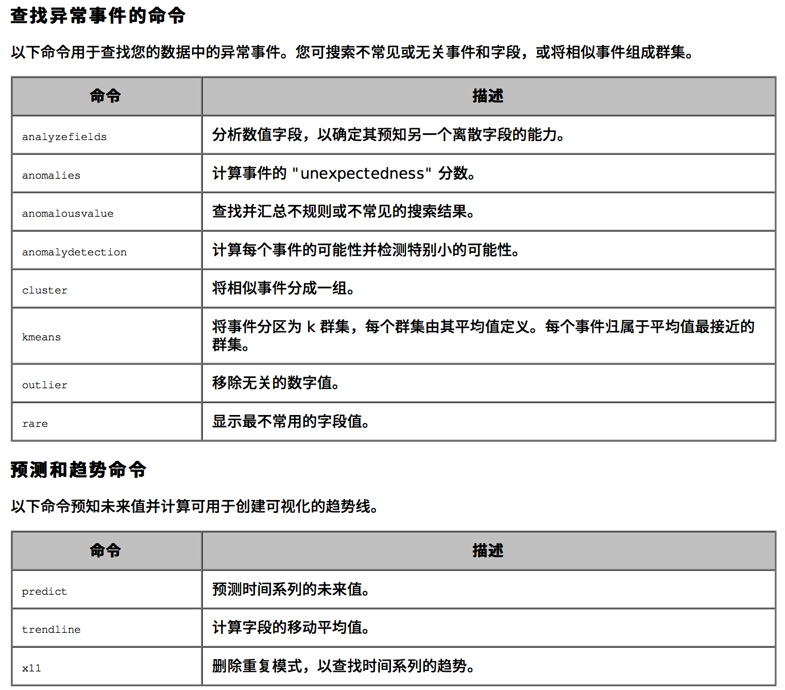

  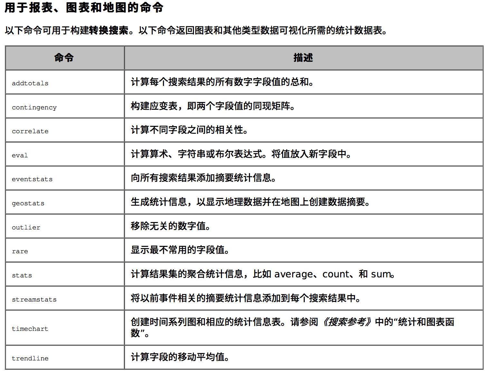

### 监控

1. 支持自定义dashboard
   - 支持自定义任意多个dashborad，每个dashboard可以包含任意多个元素
   - 支持拖拽式自定义元素布局
   - 支持全屏
   - 支持后台刷新
2. 添加dashboard元素
   * 任意从搜索、统计得到的数据都可以导出为dashboard元素
   * **由于splunk的统计功能非常强大，dashboard元素也更为丰富多彩**
   * **图表类型非常丰富，可以根据不同统计结果自定义，甚至可以在页面直接编辑图表源代码进行定制**
   * *功能强大带来的问题是操作复杂，学习成本高*

### 告警

* 将搜索保存为告警，**支持任意类型搜索**
* 支持邮件、web hook的回调方式
* *配置较复杂，交互体验一般*

### 数据收集

* 安装agent，支持来自文件（日志文件、csv文件）、网络（tcp/udp/http/WMI）
* 数据输入时支持按照正则表达式解析字段，*但是只允许配置一个正则表达式，不够灵活*

### 高级功能

* 搜索、统计、报表功能非常灵活强大
* 基于搜索、统计等功能支持插件化的app开发和下载，开发自己的各种定制化统计app

## 架构

* 一份程序，多处部署，多种角色

  * splunk完全自己实现不依赖第三方引擎，自己实现了索引、搜索和集群化（选主、复制、迁移、负载均衡...）

  * **splunk只有一份安装包，单实例安装极其简单**

  * 每个splunk实例都包含完整功能，如果日志量很小的情况下一个splunk实例就可以完成所有功能

  * 每个实例可以被配置成不同角色，实现分布式部署，包括**转发器、索引器、搜索头、主节点、管理节点**等

  * 当一个实例被指定了角色后该实例只会发挥特定角色的作用，需要的资源也不同

  * ***安装简单，但是配置运维相当复杂***，在大型分布式部署环境下需要专门的团队进行管理

    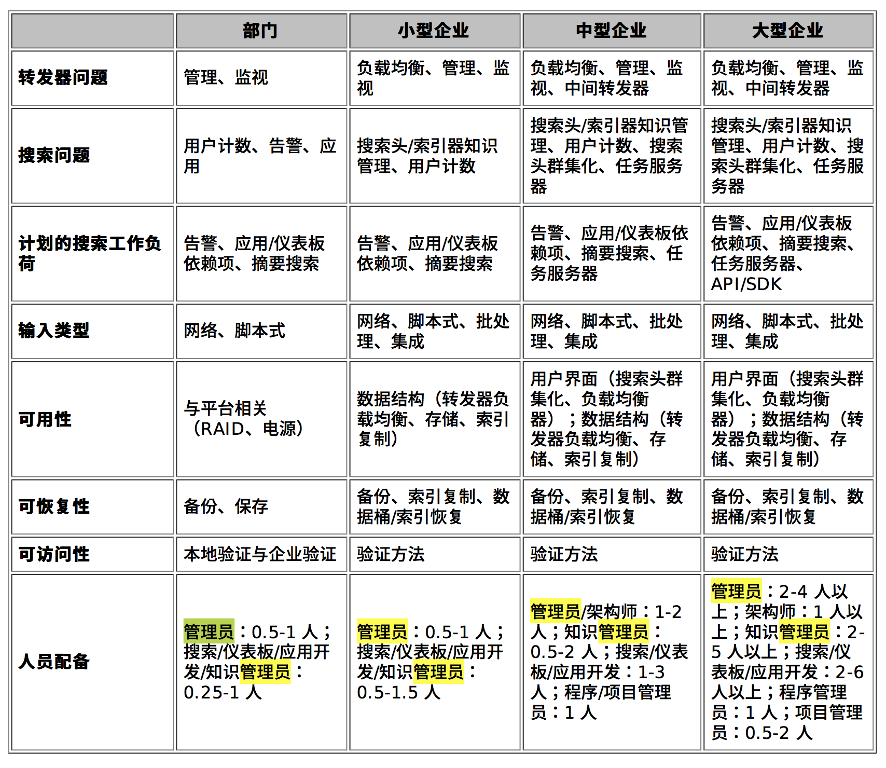

* 无第三方程序依赖

* 各个角色均支持水平扩展

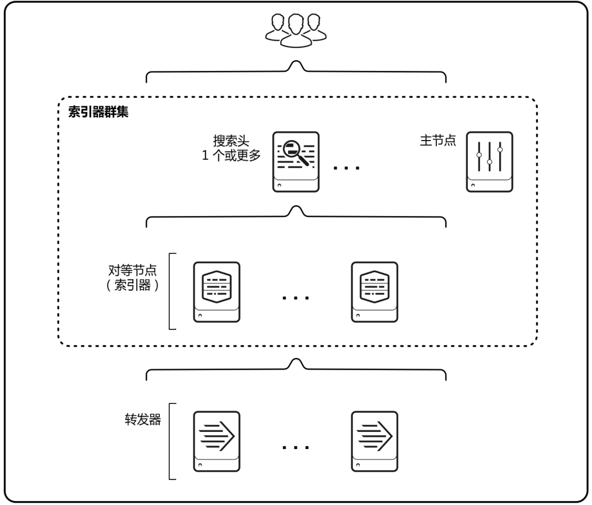

## 管理

### 部署

* 集群中所有的节点都是同一份代码同一个安装包，**单实例安装简单**
* 集群存在多种角色的节点，部署集群需要详细阅读部署文档，选择合适的部署方式，为每个节点配置不同的角色，每种角色都需要进行特殊的配置，***集群配置相对复杂***
* 没有统一的配置管理，需要单独配置节点

### 扩展

* 可以根据需求水平扩展每个角色的节点，配置相对容易，只需复制已经部署好的同类型节点的配置即可
* 手动部署

### 自监控

* **splunk有一种管理控制台的节点角色**，可以方便的对集群的节点进行**相当直观且丰富的监控**

* 管理控制台的部署有很多限制，在不同角色的集群中配置都不一样，*部署相对复杂*

* 支持对集群**索引、搜索、资源使用情况、转发器**等多维度的监控

  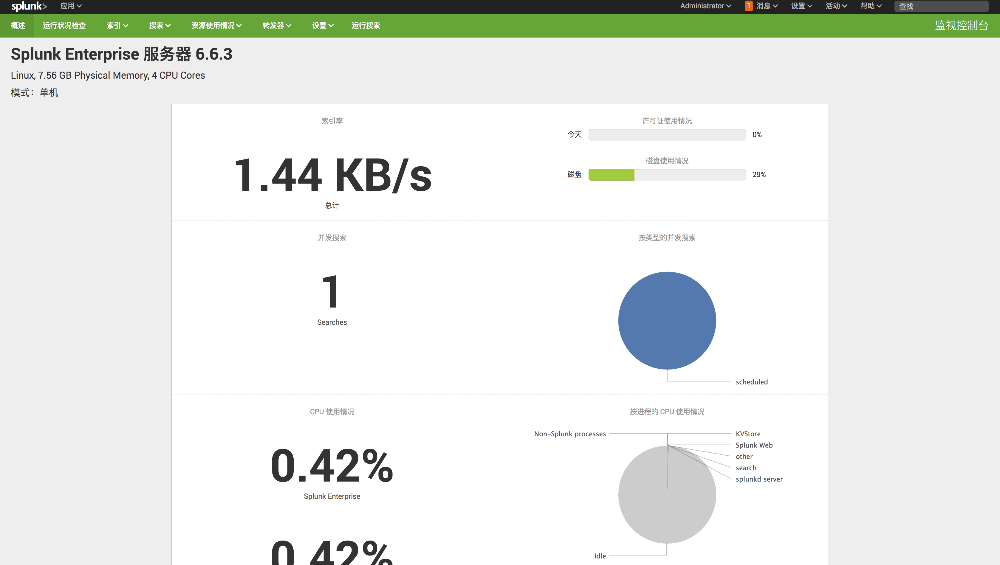

  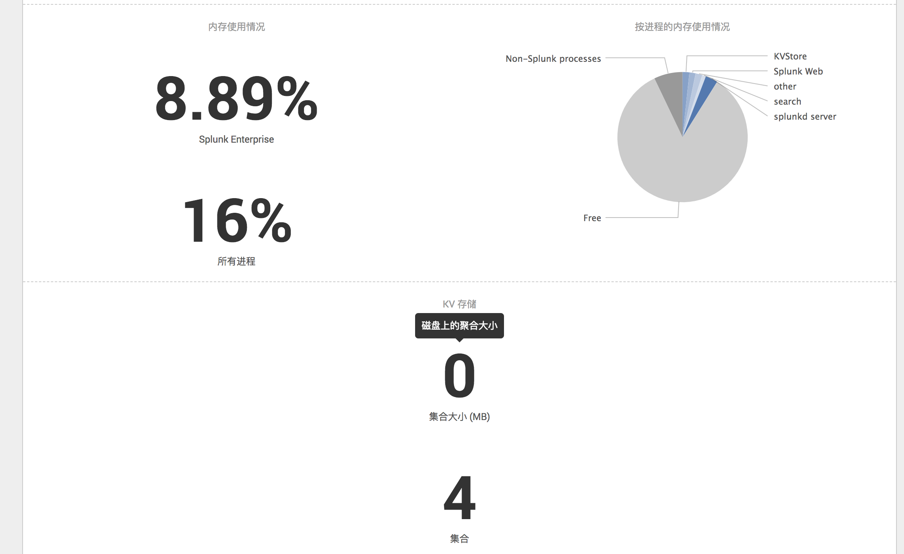

  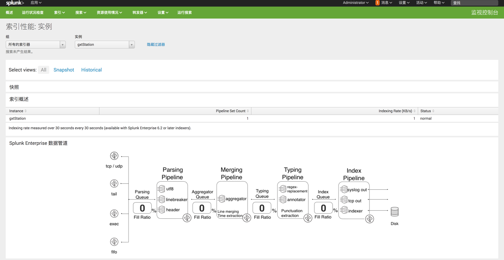

  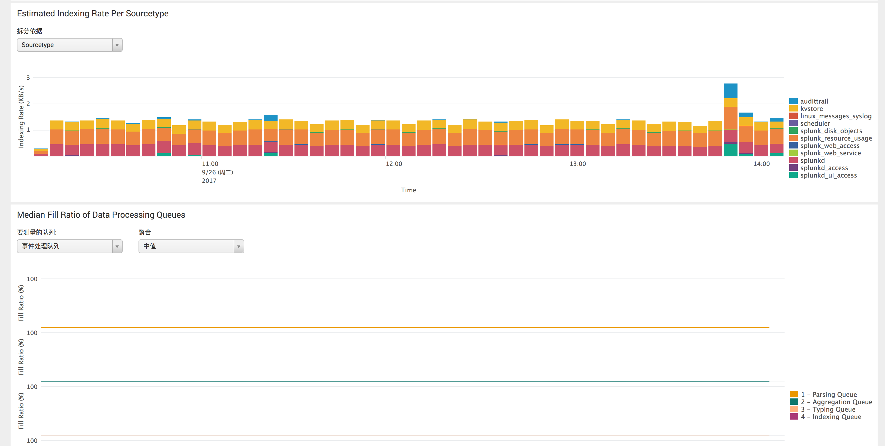

  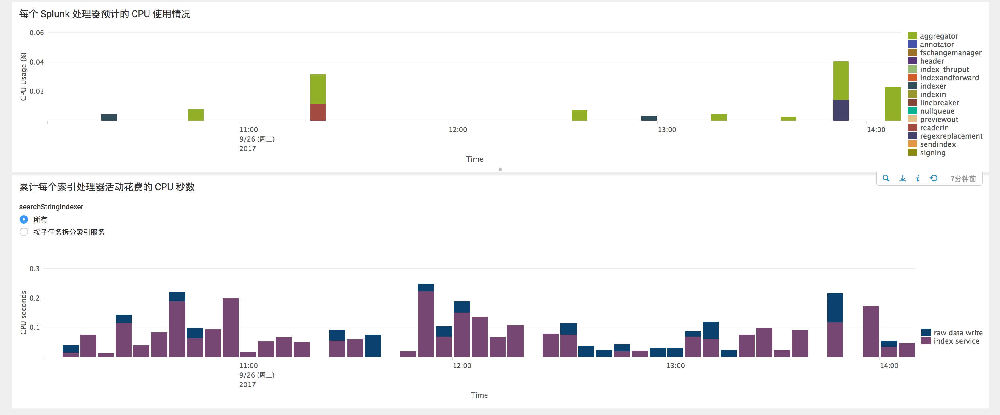

  

  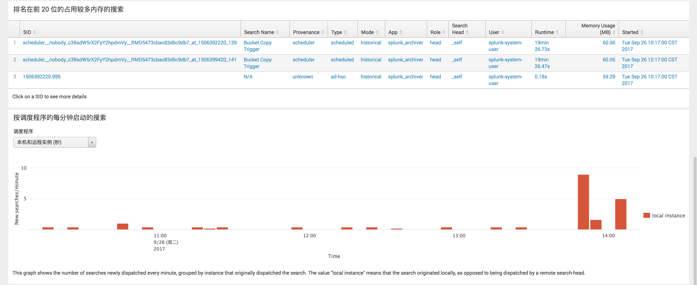

  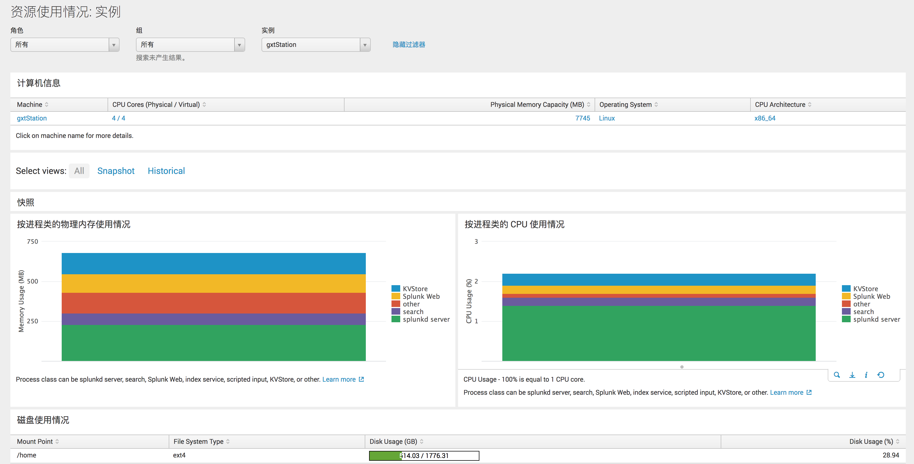

  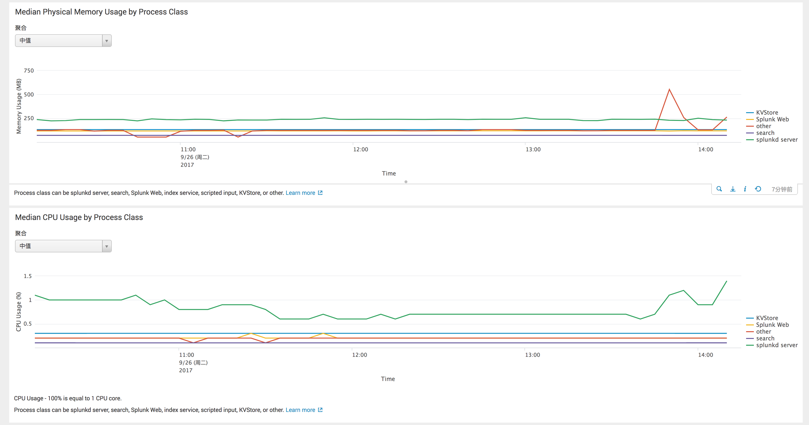

### 权限

* splunk的权限更**灵活**，例如支持指定消息分配给一个用户群，或为某个角色指定允许的消息范围，但***配置更复杂***

